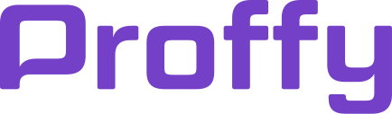

<h1>
<center>
<br>
Next Level Week #2
</center>

</h1>


## 🔖 Sobre

O Proffy é uma aplicação Web e Mobile feita para auxiliar na conexão entre os alunos e os professores. A aplicação oferece aos professores a possibilidade de registrar aulas, podendo adicionar informações como a disciplina, os horários disponíveis e o custo por hora, e aos alunos a possibilidade de buscar pelas aulas cadastradas.

Este projeto foi idealizado pensando no 6 de agosto, onde se comemora o **Dia Nacional dos Profissionais da Educação**

---
## 🚀 Tecnologias utilizadas

- Typescript
- Node.js
- ReactJS
- React Native
- Expo
- Express
- Axios
---
## ♻️ Como contribuir

Contribuições são o que fazem a comunidade open-source um lugar incrível. Qualquer contribuição que você fizer neste projeto será **muito apreciada.**

- Fork esse repositório;

- Crie uma branch com a sua feature: ``` 
git checkout -b my-feature ```

- Commit suas mudanças: ```git commit -m 'feat: My new feature'```
- Push a sua branch: ```git push origin my-feature```
- Abra uma Pull Request
---
## 🎓 Quem ministrou?

A maratona foi ministrada pelo Mestre [Diego Fernandes](https://github.com/diego3g).

---
## 📝 Licença

Esse projeto está sob a licença MIT. Veja o arquivo [LICENSE](https://github.com/HenriqL/proffy/blob/master/LICENSE) para mais detalhes.


